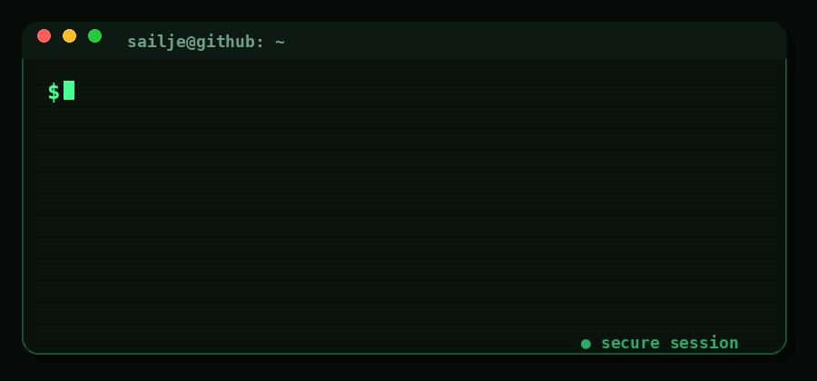

<div align="center">


### Python Backend Developer 🐍


</div>

<br>


## 👨‍💻 Обо мне

Привет! Я **Савелий** — начинающий **Python Backend Developer**.

Мне нравится создавать полноценные backend-сервисы:  
от проектирования API и базы данных до контейнеризации  
и развёртывания приложения.

- 🐍 Пишу backend на **Python**
- ⚡ Разрабатываю API на **FastAPI**
- 🗄️ Работаю с **PostgreSQL**
- 🔗 Использую **SQLAlchemy / Pydantic / Alembic**
- 🐳 Контейнеризирую проекты через **Docker**
- ☸️ Работаю с **Kubernetes**
- 🌐 Разворачиваю сервисы на **Linux / VPS / Nginx**
- 🧪 Пишу тесты через **pytest**
- 🤖 Интегрирую backend с **ML-процессами**
- 🎯 Ищу стажировку или позицию **Junior Python Backend Developer**

<br clear="right"/>

---

# 🛠️ Технологии

<div align="center">


<br><br>


<br>


</div>

---

---


## ⚙️ Обо мне в коде

```python
from fastapi import FastAPI

app = FastAPI(title="SailJe API")


@app.get("/about")
async def about_me():
    return {
        "developer": "Савелий",
        "role": "Python Backend Developer",
        "status": "🟢 Open to work",
        "superpower": "Turning ideas into working services 🚀",
    }


@app.get("/stack")
async def stack():
    return {
        "backend": ["FastAPI", "SQLAlchemy", "Pydantic"],
        "database": "PostgreSQL",
        "infrastructure": ["Docker", "Kubernetes", "Nginx"],
    }


@app.get("/currently")
async def currently():
    return {
        "learning": "System Design",
        "building": "Backend projects",
        "looking_for": "Internship / Junior position 👀",
    }


# 🚀 SailJe API started successfully
# GET /about     → 200 OK
# GET /stack     → 200 OK
# GET /currently → 200 OK
```


<div align="center">
  
</div>


# 🚀 Проекты

## 🤖 Сервис управления обучением ML-моделей

Веб-сервис для управления процессом обучения и дообучения ML-моделей через единый интерфейс.

### Что реализовал

- ⚡ Backend на **FastAPI**
- 🔌 REST API
- ⚙️ Асинхронную бизнес-логику
- 🤖 Интеграцию с ML training pipeline
- 🗄️ Базу данных **PostgreSQL**
- 🔗 ORM через **SQLAlchemy**
- 🔄 Миграции через **Alembic**
- ✅ Валидацию через **Pydantic**
- 📝 Логирование и обработку ошибок
- 🧪 Тестирование через **pytest**
- ☸️ Развёртывание в **Kubernetes**

> 🏆 Команда продолжила использовать сервис после моего ухода из проекта.

<div align="center">


</div>

---

